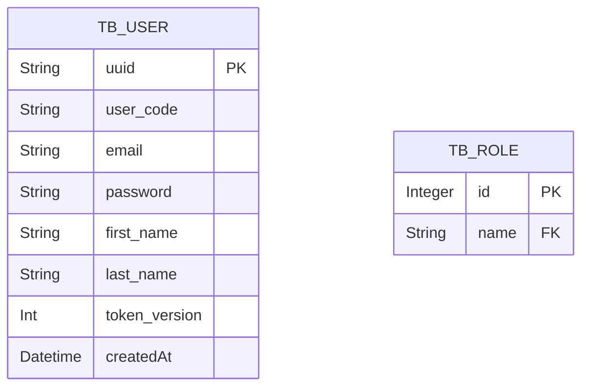

# Authentication Template API

An authentication API made to be used in any project

## :books: Features:
* <b>User's Registration</b>: Allows users registration. Payload example:
```
{
  "email": "a@gmail.com",
  "password": "123",
  "firstName": "Ari",
  "lastName": "Tedeschi"
}
```
A custom usercode is generated automatically allowing to obfuscate a user's persona into a mask.
It also an uuid as an identifier.

* <b>User's Authentication</b>: Allows users to authenticate using an email, custom usercode or an uuid.

Authentication payload:

```
{
  "login": "11441-00000-00000",
  "password": "123"
}
```

```
{
  "login": "d40f8a51-ad29-4ece-b462-6e5218c8de35",
  "password": "123"
}
```

## :clipboard: Backlog

The project uses Github Projects as a development board to save all features on **[Backlog](https://github.com/users/AriTedeschi/projects/2):**


## :computer: Entity relationship diagrams



## 🔧 Dependencies
The project requires Maven, Java 17 and a Postgrees database to run the projects
Thus, the projects uses those enviroment keys:
```
JWT_SECRET=
AUTHAPI_POSTGRES_IP=localhost:5432
AUTHAPI_POSTGRES_DB=auth
AUTHAPI_POSTGRES_SCHEAMA=?currentSchema=public
AUTHAPI_POSTGRES_USER=dbUser
AUTHAPI_POSTGRES_PASSWORD=mydbpass
```

The project provides a "dev" execution profile that uses the H2 in-memory database, in this profile it is not necessary to perform any connection configuration

To use the dev profile, change the **[application.properties](https://github.com/AriTedeschi/BrandBank-api/blob/main/src/main/resources/application.properties):** file as follows
```
spring:
    profiles:
        active: dev
```

## 🚀 Running

The api provides a bunch of docker-compose files which allows a quick setup for a local running or a test enviroment running.

### :hammer_and_wrench: Enviroment Simulation

Once you installed docker, open the command prompt at directory `/docker` and run docker-compose command to start up.
```
docker compose --env-file .env -f docker-compose.test.yml up -d
```

By running this command it uses 2 files
- Dockerfile: a custom image which compiles project's binaries and runs using a jre image
- docker-compose.test.yml: which creates a postgrees container using the secrests passed in .env and also our springboot application container applying all secrets too, setting up a test enviroment.

With that it is possible to test using swagger at **[Swagger-ui](http://localhost:8080/swagger-ui/index.html):**

To clean up after execution use:
```
docker compose --env-file .env -f docker-compose.test.yml down --volumes --rmi all
```